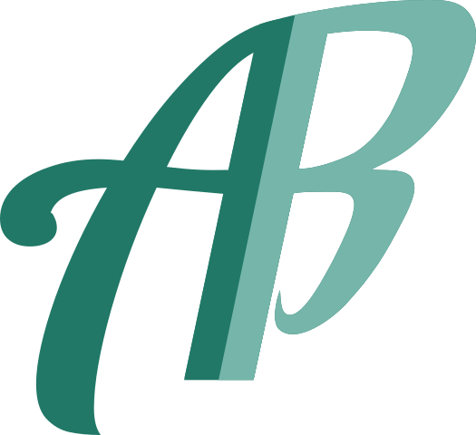

<!-- Improved compatibility of back to top link: See: https://github.com/othneildrew/Best-README-Template/pull/73 -->
<a name="readme-top"></a>
<!--
*** Thanks for checking out the Best-README-Template. If you have a suggestion
*** that would make this better, please fork the repo and create a pull request
*** or simply open an issue with the tag "enhancement".
*** Don't forget to give the project a star!
*** Thanks again! Now go create something AMAZING! :D
-->


<!-- PROJECT SHIELDS -->
<!--
*** I'm using markdown "reference style" links for readability.
*** Reference links are enclosed in brackets [ ] instead of parentheses ( ).
*** See the bottom of this document for the declaration of the reference variables
*** for contributors-url, forks-url, etc. This is an optional, concise syntax you may use.
*** https://www.markdownguide.org/basic-syntax/#reference-style-links
-->

<!-- [![Contributors][contributors-shield]][contributors-url]
[![Forks][forks-shield]][forks-url]
[![Stargazers][stars-shield]][stars-url]
[![Issues][issues-shield]][issues-url]
[![MIT License][license-shield]][license-url]
[![LinkedIn][linkedin-shield]][linkedin-url] -->


<!-- PROJECT LOGO -->
<br />
<!-- PROJECT LOGO -->
<br />
<div align="center">
  <a href="https://github.com/bouzidanas/bouzidanas.github.io/tree/main/">
    
  </a>

<h3 align="center">Golden Boot Plot Generator v1</h3>

  <p align="center">
    Generate plots of Golden Boot winners' running goal totals
    <br />
    <a href="https://github.com/bouzidanas/bouzidanas.github.io/tree/main/golden-boot/v1/README.md"><strong>Explore the docs »</strong></a>
    <br />
    <br />
    <a href="https://bouzidanas.github.io/golden-boot/v1/Haaland/"><strong>View Demo</strong></a>
    <strong>·</strong>
    <a href="https://github.com/bouzidanas/bouzidanas.github.io/tree/main/golden-boot/v1/Base/Golden-Boot-Plot-Generator.ipynb"><strong>View Plot Generator</strong></a>
  </p>
</div>


<!-- TABLE OF CONTENTS -->
<details>
  <summary>Table of Contents</summary>
  <ol>
    <li>
      <a href="#about-the-project">About The Project</a>
      <ul>
        <li><a href="#built-with">Built With</a></li>
      </ul>
    </li>
    <li>
      <a href="#getting-started">Getting Started</a>
      <ul>
        <li><a href="#prerequisites">Prerequisites</a></li>
        <li><a href="#installation">Installation</a></li>
      </ul>
    </li>
    <li><a href="#usage">Usage</a></li>
    <li><a href="#roadmap">Roadmap</a></li>
    <li><a href="#contributing">Contributing</a></li>
    <li><a href="#license">License</a></li>
    <li><a href="#contact">Contact</a></li>
    <li><a href="#acknowledgments">Acknowledgments</a></li>
  </ol>
</details>


<!-- ABOUT THE PROJECT -->
## About The Project

<div align="center">
  <a href="https://github.com/bouzidanas/bouzidanas.github.io/tree/main/golden-boot/v1/images/project-screenshot.png">
    
  </a>
</div>
<br />
<br />

<p align="center"> > <a href="https://bouzidanas.github.io/golden-boot/v1/Haaland/" ><strong>View Demo</strong></a> < </p><br />

 This Jupyter notebook project obtains data (from [FBRef.com](https://fbref.com/en/comps/9/Premier-League-Stats)) on the goals scored by each Premier League Golden Boot winner during the season the winner won the award. Then the data is used to generate running totals/cumulative sums plots so that the winner's goal scoring trajectories can be compared. <br />

<p align="right">(<a href="#readme-top">back to top</a>)</p>


### Built With

[![Jupyter][Jupyter.org]][Jupyter-url]
[![pandas][pandas-shield]][pandas-url]
[![matplotlib][matplotlib.org]][matplotlib-url]
[![CSS3][CSS3-shield]][CSS3-url]
[![Javascript][Javascript-shield]][Javascript-url]


<p align="right">(<a href="#readme-top">back to top</a>)</p>


<!-- GETTING STARTED -->
## Getting Started

All you need from this repository to generate these plots are the files in the [\Base](https://github.com/bouzidanas/bouzidanas.github.io/tree/main/golden-boot/v1/Base) folder of this repository. This folder contains a javascript file that adds interactivity to the plot, a static css file for styling, and most importantly, **a (Jupyter) notebook that generates the plot** (specifically, an html file containing the plot and a custom css file for data-dependent styling of plot elements).

## Prerequisites

You will need a few things installed to execute the code inside the notebook:

1. [Python 3.8](#python-38)
2. [Jupyter](#python-packages) (local install or cloud)
3. [pandas](#python-packages) (python package)
4. [matplotlib](#python-packages) (python package)
5. [numpy](#python-packages) (python package)
6. [Beautiful Soup 4](#python-packages) (python package)

OR

1. [Anaconda](#quick-setup)
2. [Conda](#quick-setup) (optional, recommended)

You can install all of these individually by following the steps in the links below. 

Alternatively, you can get most if not all of these things by installing anaconda (or miniconda). If the latter option is chosen, installing the conda package manager is recommended.

### Quick Start

* **Anaconda :** [instructions](https://docs.anaconda.com/anaconda/install/linux/)
* **Conda :** [instructions](https://conda.io/projects/conda/en/latest/user-guide/install/index.html)

### Python 3.8+

#### Linux:

The following command could be used to install the latest version of Python on almost every Linux system.

```
sudo apt-get install python3
```
Also, you can mention the particular version of Python you want to install, shown below :

```
sudo apt-get install python3.8 
```

#### Windows and Mac:

* [Installers for Windows](https://www.python.org/downloads/windows/) and [installation instructions](https://www.tomshardware.com/how-to/install-python-on-windows-10-and-11#:~:text=Open%20a%20browser%20to%20the%20Python%20website%20and%20download%20the%20Windows%20installer.&text=2.,on%20Install%20now%20to%20begin.).

* [Installers for Mac](https://www.python.org/downloads/macos/) and [installation instructions](https://www.dataquest.io/blog/installing-python-on-mac/).

### Python Packages

* [Installation instructions for Jupyter](https://jupyter.org/install)

* [Installation instructions for pandas](https://pandas.pydata.org/docs/getting_started/install.html)

* [Installation instructions for matplotlib](https://matplotlib.org/stable/users/installing/index.html)

* [Installation instructions for numpy](https://numpy.org/install/)

* [Installation instructions for Beautiful Soup 4](https://www.geeksforgeeks.org/beautifulsoup-installation-python/)

<p align="right">(<a href="#readme-top">back to top</a>)</p>

## Installation

1. Clone the repo

   ```
   git clone https://github.com/bouzidanas/bouzidanas.github.io/
   ```
<p align="right">(<a href="#readme-top">back to top</a>)</p>

<!-- USAGE EXAMPLES -->
## Usage

To generate a new plot (the html along with the accompanying css), open the generator notebook (`.ipynb`) and edit the second and third code cells:

```
#Filenames for html and css file creation and saving
html_filename = "index.html"
generated_css_filename = "style.css"
base_css_filename = "golden-boot-base.css"
javascript_filename = 'golden-boot.js'

#Parameters used to customize generated html and css contents
page_title = 'Premier League Golden Boot Winners'
page_description = 'Golden Boot Winners Goals: Running Total'
background_image_url = 'https://pbs.twimg.com/media/D5G92AqW4AEaJlk.jpg:large'
gradient_color = "#f4ab49"
xlabel_color = "#2f4f4f"
ylabel_color = "white"
gridline_color = ylabel_color
team_colors = { 'Blackburn Rovers': ['#009EE0', '#FFFFFF'],\
                'Newcastle United': ['#241F20', '#FFFFFF'],\
                'Coventry City': ['#77bbff', '#FFFFFF'],\
                'Liverpool': ['#C8102E', '#F6EB61'],\
                'Manchester United': ['#DA291C', '#FBE122'],\
                'Leeds United': ['#1D428A', '#FFCD00'],\
                'Sunderland': ['#000000', '#ff0000'],\
                'Chelsea': ['#034694', '#dba111'],\
                'Arsenal': ['#db0007', '#9c824a'],\
                'Manchester City': ['#6CABDD', '#FFFFFF'],\
                'Tottenham Hotspur': ['#132257', '#FFFFFF'],\
                'Leicester City': ['#003090', '#FDBE11'] }
```

and also

```
#Parameters for adding a player's stats for non-Golden-Boot-winning season
add_additional_player = True
highlight_additional_player = False

#Make sure name and team matches Golden Boot Winners table. 
#Also the dash in the date needs to be the special dash '–' not the regular one '-'
additional_player_info = {'name': 'Mohamed Salah', 'team': 'Liverpool', 'season': '2022–23'}
rows_to_drop = 3

#Data source url related stuff
url = 'https://en.wikipedia.org/wiki/Premier_League_Golden_Boot'
src_ending_str = '-Match-Logs'
#The player id's can be found in the url of the player's page on FBREF.com
player_fbref_id = { 'Erling Haaland': '1f44ac21',\
                    'Alan Shearer': '438b3a51',\
                    'Chris Sutton': '83c38e36',\
                    'Dion Dublin': 'a0886d18',\
                    'Michael Owen': '88b3f52c',\
                    'Dwight Yorke': '2d0a99d3',\
                    'Jimmy Floyd Hasselbaink': 'db8a04d1',\
                    'Kevin Phillips': '23d97ca1',\
                    'Thierry Henry': 'c0c5ee74',\
                    'Ruud van Nistelrooy': '80a30989',\
                    'Didier Drogba': '945dea33',\
                    'Cristiano Ronaldo': 'dea698d9',\
                    'Nicolas Anelka': '931ed5e9',\
                    'Carlos Tevez': 'c1a26d43',\
                    'Dimitar Berbatov': 'f5781978',\
                    'Robin van Persie': '3fcab3a8',\
                    'Luis Suárez': 'a6154613',\
                    'Sergio Agüero': '4d034881',\
                    'Pierre Emerick Aubameyang': 'd5dd5f1f',\
                    'Sadio Mané': 'c691bfe2',\
                    'Jamie Vardy': '45963054',\
                    'Son Heung min': '92e7e919',\
                    'Mohamed Salah': 'e342ad68',\
                    'Harry Kane': '21a66f6a' }
```

The `url` parameter contains the url to a site containing a table of the winners of the Golden Boot award. The `page_title` parameter contains the title of the html page which is also used as the title of the plot inside the page. The `team_colors` list contains the colors used for the lines in the plot and the legend where each player in the legend and corresponding line is color coded according to the team the player belonged to when they won the award. The "light" colors are used for highlighting players and their respective lines.

Note also that `ylabel_color` determines the color of the title, y-axis numbers and horizontal gridlines, while `xlabel_color` determines the color of the x-axis numbers, unselected legend labels, and axis labels. 

You can drop rows from the beginning of the winners table by setting `rows_to_drop`. 

The `additional_player` parameters allow for adding the stats/data of an additional player for a season where the player did not win the award. When adding a player, make sure that to add the player's name and FBref id to the `player_fbref_id` list if not already in the list. The player's FBref id can be found in the url of the players page on FBref.com. 

Example:

<p align="left">
  <a href="https://github.com/bouzidanas/bouzidanas.github.io/tree/main/golden-boot/v1/images/fbref-id-example.png">
      
  </a>
</p>

<p align="right">(<a href="#readme-top">back to top</a>)</p>

<!-- CONTRIBUTING -->
## Contributing

Contributions are what make the open source community such an amazing place to learn, inspire, and create. Any contributions you make are **greatly appreciated**.

If you have a suggestion that would make this better, please fork the repo and create a pull request. You can also simply open an issue with the tag "enhancement".
Don't forget to give the project a star! Thanks again!

1. Fork the Project
2. Create your Feature Branch (`git checkout -b feature/AmazingFeature`)
3. Commit your Changes (`git commit -m 'Add some AmazingFeature'`)
4. Push to the Branch (`git push origin feature/AmazingFeature`)
5. Open a Pull Request

<p align="right">(<a href="#readme-top">back to top</a>)</p>


<!-- LICENSE -->
<!-- ## License

Distributed under the MIT License. See `LICENSE.txt` for more information.

<p align="right">(<a href="#readme-top">back to top</a>)</p> -->


<!-- CONTACT -->
## Contact

Anas Bouzid - anasbouzid@gmail.com

Project Link: [https://github.com/bouzidanas/bouzidanas.github.io](https://github.com/bezda-analytics/bezda-analytics.github.io)

<p align="right">(<a href="#readme-top">back to top</a>)</p>


<!-- ACKNOWLEDGMENTS -->
## Acknowledgments

* [FBref.com](https://fbref.com/en/)


<p align="right">(<a href="#readme-top">back to top</a>)</p>


<!-- MARKDOWN LINKS & IMAGES -->
<!-- https://www.markdownguide.org/basic-syntax/#reference-style-links -->
[contributors-shield]: https://img.shields.io/github/contributors/github_username/repo_name.svg?style=for-the-badge
[contributors-url]: https://github.com/github_username/repo_name/graphs/contributors
[forks-shield]: https://img.shields.io/github/forks/github_username/repo_name.svg?style=for-the-badge
[forks-url]: https://github.com/github_username/repo_name/network/members
[stars-shield]: https://img.shields.io/github/stars/github_username/repo_name.svg?style=for-the-badge
[stars-url]: https://github.com/github_username/repo_name/stargazers
[issues-shield]: https://img.shields.io/github/issues/github_username/repo_name.svg?style=for-the-badge
[issues-url]: https://github.com/github_username/repo_name/issues
[license-shield]: https://img.shields.io/github/license/github_username/repo_name.svg?style=for-the-badge
[license-url]: https://github.com/github_username/repo_name/blob/master/LICENSE.txt
[linkedin-shield]: https://img.shields.io/badge/-LinkedIn-black.svg?style=for-the-badge&logo=linkedin&colorB=555
[linkedin-url]: https://linkedin.com/in/linkedin_username
[product-screenshot]: https://bezda-analytics.github.io/golden-boot-v1/images/golden-boot-project-example-screenshot1.png
[Next.js]: https://img.shields.io/badge/next.js-000000?style=for-the-badge&logo=nextdotjs&logoColor=white
[Next-url]: https://nextjs.org/
[React.js]: https://img.shields.io/badge/React-20232A?style=for-the-badge&logo=react&logoColor=61DAFB
[React-url]: https://reactjs.org/
[Vue.js]: https://img.shields.io/badge/Vue.js-35495E?style=for-the-badge&logo=vuedotjs&logoColor=4FC08D
[Vue-url]: https://vuejs.org/
[Angular.io]: https://img.shields.io/badge/Angular-DD0031?style=for-the-badge&logo=angular&logoColor=white
[Angular-url]: https://angular.io/
[Svelte.dev]: https://img.shields.io/badge/Svelte-4A4A55?style=for-the-badge&logo=svelte&logoColor=FF3E00
[Svelte-url]: https://svelte.dev/
[Laravel.com]: https://img.shields.io/badge/Laravel-FF2D20?style=for-the-badge&logo=laravel&logoColor=white
[Laravel-url]: https://laravel.com
[Bootstrap.com]: https://img.shields.io/badge/Bootstrap-563D7C?style=for-the-badge&logo=bootstrap&logoColor=white
[Bootstrap-url]: https://getbootstrap.com
[JQuery.com]: https://img.shields.io/badge/jQuery-0769AD?style=for-the-badge&logo=jquery&logoColor=white
[JQuery-url]: https://jquery.com 
[Jupyter.org]: https://img.shields.io/badge/jupyter-%23FA0F00.svg?style=for-the-badge&logo=jupyter&logoColor=white
[Jupyter-url]: https://jupyter.org/
[CSS3-shield]: https://img.shields.io/badge/css3-%231572B6.svg?style=for-the-badge&logo=css3&logoColor=white
[CSS3-url]: https://www.w3.org/Style/CSS/Overview.en.html
[matplotlib.org]: https://img.shields.io/badge/Matplotlib-%23ffffff.svg?style=for-the-badge&logo=Matplotlib&logoColor=black
[matplotlib-url]: https://matplotlib.org/ 
[pandas-url]: https://pandas.pydata.org/
[pandas-shield]: https://img.shields.io/badge/pandas-%23150458.svg?style=for-the-badge&logo=pandas&logoColor=white
[JavaScript-shield]: https://img.shields.io/badge/javascript-%23323330.svg?style=for-the-badge&logo=javascript&logoColor=%23F7DF1E
[JavaScript-url]: https://developer.mozilla.org/en-US/docs/Web/JavaScript
